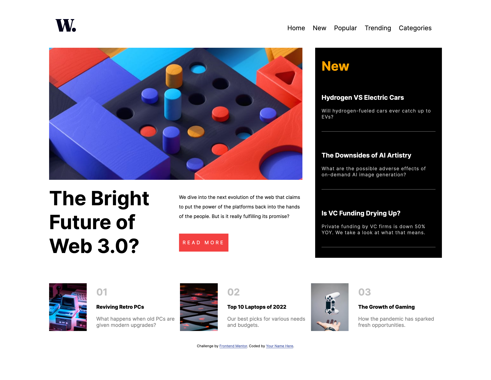
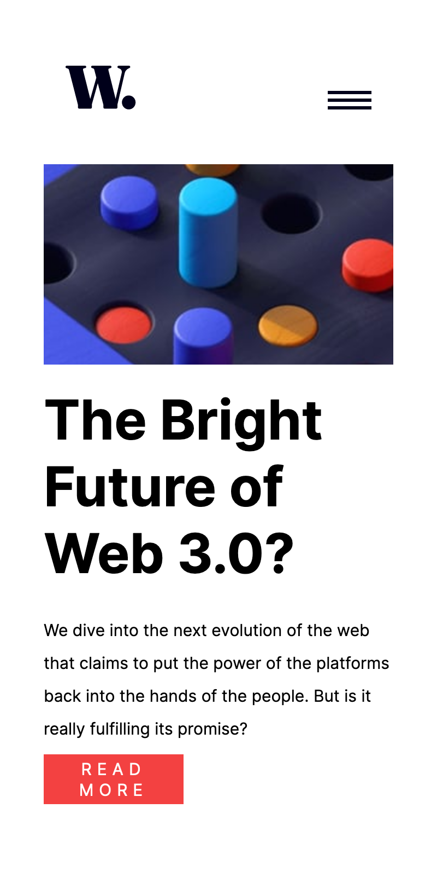
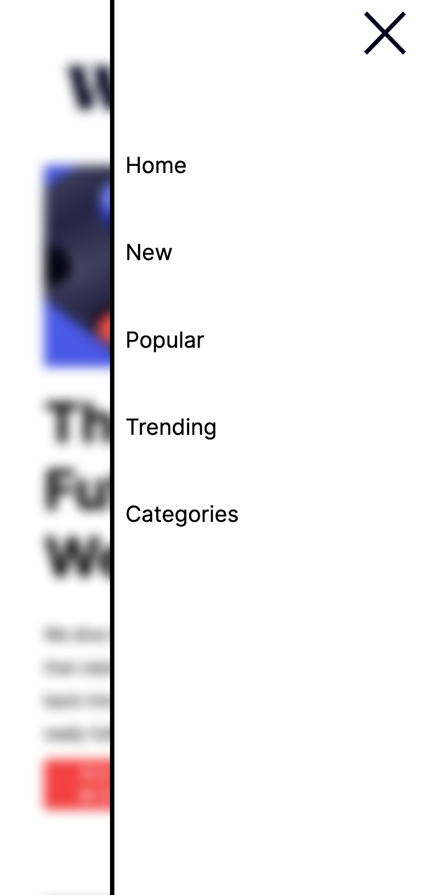

## News Website Homepage

This is a component project for the homepage of a news / blog website.

## Table of contents

- [Overview](#overview)
  - [The challenge](#the-challenge)
  - [Screenshot](#screenshot)
  - [Links](#links)
- [My process](#my-process)
  - [Built with](#built-with)
- [Author](#author)

## Overview

My project creates a news homepage that displays "hero" content, as well as "New" content and a "top 3" section.

The project is both desktop and mobile friendly and provides interactive elements for hover and active functions as well as a mobile menu system that is stick upon scroll.

### The challenge

- View the optimal layout for the interface depending on their device's screen size
- See hover and focus states for all interactive elements on the page
- Provide an easy-to-adjust format using CSS Grid.

### Screenshot

### Links
- Live Site URL: [Add live site URL here](https://croftkie.github.io/news-homepage-FM/)

## My process

### Built with

- Semantic HTML5 markup
- CSS custom properties
- SCSS Styling
- Flexbox
- CSS Grid
- Mobile-first workflow

## Author

Kieran Croft
- Website - [Add your name here](https://www.your-site.com)

